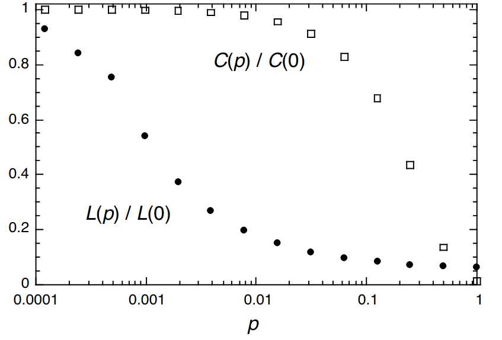

# Experimento W-S

De lo que se trata esta actividad es que utilicen la última función introducida en el Notebook pasado, `re_enlazar(G,p)`, para **reproducir** el siguiente resultado publicado por Watts y Strogatz en su artículo:

Lo interesante de este resultado es que, como pueden ver, hay un régimen para la probabilidad en el que el coeficiente de clustering se mantiene alto, muy similar al valor original, mientras que el diámetro de la red disminuyó abruptamente. En tal régimen se tendrían redes con propiedad de mundo pequeño y gran clustering, características de muchas redes reales.

Como información de la imagen para que la reproduzcan, pueden ver en el artículo que se informa:

> The data shown in the figure are averages over 20 random realizations of the rewiring process (...) and have been normalized by the values $L(0)$, $C(0)$ for a regular lattice.

Además:

> All the graphs have $n= 1000$ vertices and an average degree of $k=10$ edges pervertex.

Esto implicaría que cada nodo del arreglo original estaba conectado a quintos vecinos.

## Recomendaciones:

- Notar que el dominio de la gráfica está en escala logarítmica, sin embargo los puntos están a la misma distancia entre ellos.
  - Esto lo pueden lograr con la función de numpy `np.logspace(A, B, n)` que les da un conjunto de $n$ valores, de $10^{A}$ a $10^{B}$, que en escala logarítmica están homogéneamente separados.
- Pueden generar tal arreglo y luego usarlo para un bucle de la forma  `for p in arreglo:`.
- No tomen de entrada redes de 1000 nodos con grado 10 (lo que implicaría que están conectadas a quintos vecinos).
  - Empiecen con valores más pequeños, tal vez 100 nodos a segundos o terceros vecinos, y 5 corridas en lugar de 20, mientras van generando su gráfica.
  - Ya después pueden ponerle los valores finales y dejarla correr toda la noche (o más).

Su resultado deberán subirlo al foro con ese propósito.

